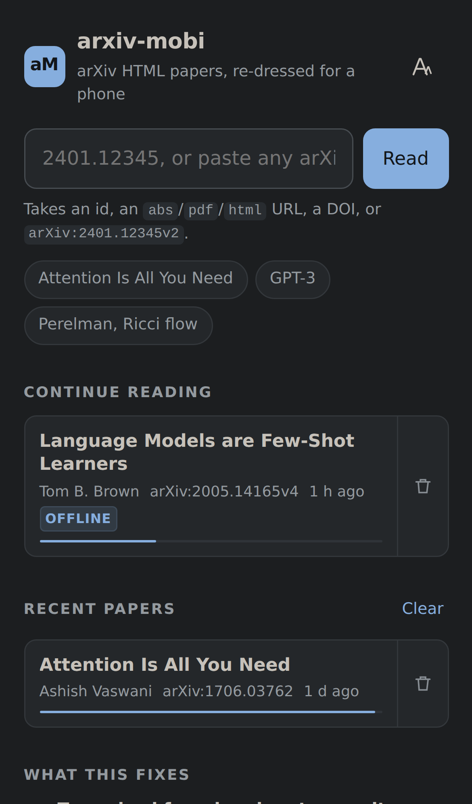

# arxiv-mobi

**arXiv's HTML papers, re-dressed for a phone.** Paste an arXiv id or link and
read the paper with typography, tables, figures and a dark theme that were
designed for a 390-pixel screen instead of a desktop browser window.

It is a static site: no server, no build step, no accounts, no tracking. Your
browser fetches the paper straight from `arxiv.org` and this site replaces the
stylesheet and rewires the interactions. Host it on GitHub Pages and it costs
nothing to run.



---

## Why

arXiv now publishes HTML for most new submissions, which is a huge improvement
over pinch-zooming a two-column PDF. But the HTML is still a desktop document:

| Problem on a phone | What arxiv-mobi does |
| --- | --- |
| Body text is set for a wide monitor | Smaller default measure and size, tuned for a hand, with size, line spacing and typeface controls |
| Text is justified in a ~40-character column, so word spacing tears open into rivers | Left-aligned by default; justification is opt-in and turns hyphenation on with it |
| Dark mode leaves the authors' literal colours in place, so tables and code frames become blinding white slabs with black text | Every baked-in colour is re-mapped into the active theme — hue preserved, contrast checked against the page |
| Figures render at a few hundred pixels; axis labels are unreadable | Tap any figure for a full-screen viewer with pinch, double-tap and wheel zoom, panning and swipe-to-next |
| Wide tables and equations push the whole page sideways | They are scaled down to fit where possible, and get their own scroll box (with the equation number pinned in view) where not |
| Tapping `[17]` teleports you to the bibliography and loses your place | References, footnotes, figures and equations open in a sheet where you are, with a "go to it" escape hatch |
| No sense of place in a 40-page paper | Contents drawer with the current section tracked, a progress bar, and your position restored when you come back |
| Only usable online | Installable as an app, papers (and their figures) saved for offline reading |

The dark theme is modelled on [sioyek](https://sioyek.info)'s: a deep neutral
ground with the ink pulled down to a warm off-white rather than pure white on
pure black, so glyph edges stop glowing. There is also a true-black variant for
OLED screens and a sepia one for lamp light.

## Opening a paper

Any of these work:

- **The box on the front page** — an id (`2401.12345`), a versioned id
  (`2401.12345v2`), an old-style id (`hep-th/9711200`), any arXiv URL
  (`abs`/`pdf`/`html`), an ar5iv URL, `arXiv:2401.12345`, or the DOI form
  `10.48550/arXiv.2401.12345`.
- **Swap the host of an arXiv URL.** `arxiv.org/abs/2401.12345` becomes
  `your-site/abs/2401.12345`. `/pdf/…`, `/html/…` and a bare `/2401.12345`
  work too — `404.html` does the routing, so it needs no server.
- **The bookmarklet** on the front page: press it on any arXiv page.
- **The share sheet**, once installed as an app: share an arXiv link from any
  other app straight into arxiv-mobi (a PWA share target).
- **A direct link**: `read.html?id=2401.12345v2`.

## Reading settings

Everything is stored locally and applies immediately.

| Setting | Notes |
| --- | --- |
| Theme | Auto / Light / Sepia / Dark / Black. Auto follows the OS. |
| Typeface | Serif or sans for the paper text; the UI stays sans. |
| Text size | 80–170% of a 17px base. |
| Line spacing | 1.25–2.00. |
| Column width | Only shown on wide screens, where it actually bites. |
| Justify text | Off by default. On also enables hyphenation. |
| Figures on dark | **Plate** (a light card behind the figure — best for black line art), **Invert**, **Dim**, or **Raw**. |
| Recolour baked-in colours | The table/code/highlight remapping described below. On by default. |
| Shrink wide equations / tables | Scale to fit before falling back to sideways scrolling. |
| Striped table rows | Zebra striping. |
| Tap references to peek | Turn off to make references jump normally. |
| Hide toolbar while reading | Toolbar slides away as you scroll down. |

Keyboard, for desktop or a connected keyboard: `t` contents, `a` settings,
`m` more actions, `d` cycle theme, `j`/`k` scroll, `g`/`G` top/bottom,
`Esc` close. In the figure viewer: arrows to change figure, `+`/`-`/`0` zoom.

## Deploy your own copy

1. Fork this repository (or push it to a new one).
2. **Settings → Pages**. Either pick *Deploy from a branch* → `main` / `/`
   (the repository already contains `.nojekyll`), or leave it on *GitHub
   Actions* and let [`.github/workflows/pages.yml`](.github/workflows/pages.yml)
   publish on every push.
3. Open `https://<you>.github.io/<repo>/`.

Every path in the site is relative, so it works under a project path
(`/arxiv-mobi/`), at the root of a user site, or on a custom domain, with no
configuration.

## Local development

```sh
node tools/serve.mjs            # http://127.0.0.1:8099 — serves 404.html like Pages does
```

That is the whole toolchain for editing: no bundler, no dependencies, ES
modules straight from disk.

### Tests

The smoke test drives the real reader in headless Chromium at iPhone size and
asserts the properties this project exists to guarantee.

```sh
npm i -D playwright                        # once
mkdir -p /tmp/am-fixtures
curl -sS https://arxiv.org/html/1706.03762 -o /tmp/am-fixtures/1706.03762.html
curl -sS https://arxiv.org/html/2005.14165 -o /tmp/am-fixtures/2005.14165.html

node tools/serve.mjs &
node tools/smoke.mjs --fixtures /tmp/am-fixtures
```

Fixtures are served by request interception, so runs are deterministic and
need no network. `--live` fetches from arXiv instead, `--shots <dir>` writes
screenshots in all four themes plus the lightbox, peek sheet, contents drawer
and settings, and bare ids limit the run to those papers.

What it checks, per paper: no page errors, nothing executable survives
sanitising, the layout viewport never scrolls sideways and no element escapes
the column (in portrait, in landscape, and back), prose is not justified,
every table is in a scroll box, the dark theme leaves no light surfaces
behind, all paper text clears 4:1 contrast, figures open and zoom, citations
peek, the contents drawer opens, and preference changes take effect.

Then, once: the "no HTML version" screen, saving a paper and re-opening it
with the network switched off (including that its figures still paint), the
landing page, all four URL routing forms, and service-worker registration and
shell caching.

## How it works

```
index.html      landing: open a paper, reading list, appearance
read.html       the reader shell
404.html        turns /abs/2401.12345 into read.html?id=2401.12345
sw.js           app shell + paper + figure caches for offline reading
assets/css/
  base.css      design tokens, the four palettes, app chrome
  reader.css    the whole visual contract for paper content
  app.css       toolbar, contents, lightbox, peek sheet, states
  landing.css   landing page
assets/js/
  arxiv-id.js   parses anything that might contain an arXiv id
  fetcher.js    fetch + cache, with the "no HTML version" cases
  transform.js  sanitise, absolutise URLs, restructure for a phone
  color.js      colour parsing, WCAG contrast, the adaptation model
  recolor.js    applies that model to the paper's inline colours
  reader.js     orchestration: fitting passes, chrome, actions
  lightbox.js   figure viewer and its pointer maths
  peek.js       reference/footnote sheets and the return chip
  toc.js        contents drawer and section tracking
  library.js    reading list and positions (localStorage)
  settings.js   preferences and the settings UI
tools/          dev server, smoke test, icon generator
```

**Fetching.** `arxiv.org/html/…` answers with `access-control-allow-origin: *`,
which is what makes a serverless reader possible at all: the page fetches the
document directly. Papers with no HTML version answer `404` *without* CORS
headers, so the browser reports a network error rather than a status code —
both land on the same explanatory screen, which offers the PDF, the abstract
page and [ar5iv](https://ar5iv.labs.arxiv.org).

**Sanitising.** The document is parsed into an inert `DOMParser` document,
where scripts, styles, frames, forms, event-handler attributes and unsafe URL
schemes are removed and every relative URL is made absolute. Only then is the
`<article>` adopted into the live page. (Adopting first would run arXiv's own
scripts; `<object type="image/svg+xml">` figures are converted to `` on
the way through, which also makes them zoomable.)

**Restructuring.** Tables, equation tables and anything else that ends up wider
than the column are wrapped in scroll boxes with edge fades; short table cells
are kept on one line and prose cells are left free to wrap; figures get a plate
wrapper and a zoom affordance; footnote marks become buttons; the contents are
built from the real headings. After layout, three measuring passes run: shrink
over-wide tables and equations, give over-wide formulas their own scroller, and
a final sweep that turns anything still overflowing into a scroll container.
That last pass is the safety net for LaTeXML's habit of baking absolute point
widths into `\rule`s, `\parbox`es and verbatim spans.

`\resizebox`/`\scalebox` around a table gets undone rather than honoured.
LaTeXML implements them as a fixed-size box plus a `translate(…) scale(…)` on
the contents, with geometry computed for the paper's page width; kept as-is on
a phone it drags the table out of its own box and off the side of the screen,
so the caption renders and the table does not. Dropping the wrapper hands the
table to the fit pass, which scales it by font size instead — crisp, still
selectable, and free to scroll. Real rotations (`\rotatebox`, used for slanted
column headers) are left alone, because there the transform *is* the content.

**Re-colouring.** LaTeXML writes author colour choices into inline styles, as
either `background-color:#F2F2F2` or the newer `--ltx-bg-color` custom
properties. `reader.css` wires those properties to real declarations and
`recolor.js` rewrites their *values* for the current theme. It is not a filter
invert: each colour is parsed, converted to HSL, and re-anchored against the
theme's own background and text lightness while keeping its hue, using chroma
rather than HSL saturation to decide whether a colour is actually colourful (a
pale pink reads as fully saturated otherwise). Text colours are then nudged
until they clear a 4.5:1 contrast ratio against the page. Originals are stashed
on the element, so switching back to a light theme restores the paper exactly.

## Limitations

- **Not every paper has HTML.** arXiv generates it from LaTeX source, mostly
  for submissions from December 2023 onwards plus a growing back-catalogue.
  When there is none, you get the PDF/abstract/ar5iv screen.
- **arXiv's HTML is itself imperfect.** Some conversions lose figures or
  mangle heavy TeX. The "Try the ar5iv rendering" action is there for those.
- **Maths needs MathML**, which every current browser has. Without it the
  reader falls back to showing the TeX source.
- **Offline caching is browser storage**, so it lasts until the browser
  reclaims it. Papers you explicitly save are kept in preference to the
  dozen most recent ones.

## Privacy

Preferences, reading positions and the reading list live in `localStorage`;
saved papers live in the Cache Storage API. Nothing is sent anywhere: there is
no analytics, no cookies, and no backend to send it to. The only network
requests are to `arxiv.org` for the paper you asked for.

## Credits and licence

Papers are the work of their authors and carry whichever licence is shown on
arXiv. The HTML comes from arXiv's [LaTeXML](https://math.nist.gov/~BMiller/LaTeXML/)
pipeline, whose class names this project styles; thanks also to the
[ar5iv](https://ar5iv.labs.arxiv.org) project, which pioneered readable HTML
for arXiv. The dark theme takes its cue from [sioyek](https://sioyek.info).

Code is MIT licensed — see [LICENSE](LICENSE).
